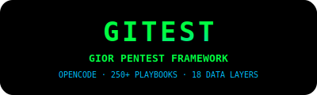

<picture>
  <source media="(prefers-color-scheme: dark)" srcset=".github/assets/logo.svg">
  
</picture>

<br>

<div align="center">

# GITEST — GIOR PENTEST FRAMEWORK

<span style="color:#e4e4e7;font-weight:500">AUTONOMOUS PENETRATION TESTING ORCHESTRATION FOR OPENCODE</span><br>
<span style="color:#22c55e">250+ SKILL PLAYBOOKS</span> <span style="color:#52525b">·</span> <span style="color:#22c55e">18 INTELLIGENCE DATA LAYERS</span> <span style="color:#52525b">·</span> <span style="color:#22c55e">109 SECURITY TOOLS</span>

[](LICENSE)
[](#skill-playbooks)
[](#intelligence-data-layers)
[](#tools-catalog)
[](https://opencode.ai)
[](CONTRIBUTING.md)

<br>

**[INSTALLATION](#installation) · [QUICK START](#quick-start) · [FEATURES](#features) · [ARCHITECTURE](#architecture) · [CONTRIBUTING](#contributing) · [LICENSE](#license)**

</div>

---

GITEST is a comprehensive penetration testing automation framework built as a command plugin for **OpenCode**. It transforms a single target URL into a full-chain exploitation pipeline — from reconnaissance and OSINT through vulnerability detection, exploitation, post-exploitation, and report generation with CVSS v3.1 scoring.

Unlike monolithic scanners, GITEST leverages OpenCode's agent capabilities to dynamically select and execute **250+ skill playbooks** tailored to each target's technology stack, powered by **18 structured intelligence layers** covering attack chains, WAF signatures, CVE correlations, and more.

---

## QUICK START

```bash
git clone https://github.com/GiorMalik/gitest.git
cd gitest
chmod +x setup.sh && ./setup.sh
/gitest https://target.example.com
```

> **Requirements:** OpenCode CLI, bash, curl, jq, python3  
> **Recommended:** nmap, nuclei, ffuf, sqlmap, dalfox

---

## FEATURES

| Feature | Description |
|---------|-------------|
| **MULTI-PHASE PIPELINE** | 15+ phases: recon, OSINT, code analysis, CMS/CRM exploitation, API attacks, auth testing, supply chain, cloud, data exfiltration simulation |
| **250+ SKILL PLAYBOOKS** | Targeted playbooks for vulnerability classes, technologies, protocols, frameworks, CTF categories, and post-exploitation |
| **18 INTELLIGENCE LAYERS** | Attack chains, CVE correlations, WAF signatures, tech/port correlations, fuzzer data, patterns, and more loaded at runtime |
| **109 TOOLS CATALOG** | From recon (subfinder, nmap) to exploitation (sqlmap, dalfox) to C2 (metasploit, sliver) and cloud (pacu, prowler) |
| **COMPETITOR SIMULATION** | Reports simulate real attacker/competitor behavior for each finding |
| **CVSS V3.1 SCORING** | Every finding scored with industry-standard CVSS v3.1 metrics |
| **STRUCTURED OUTPUT** | Organized directory layout under `SCAN/targets/<domain>/` with recon, loot, exploits, reports, screenshots, payloads |

### PIPELINE PHASES

```
RECON → OSINT → CODE ANALYSIS → CMS/CRM → API → AUTH → SUPPLY CHAIN → CLOUD → EXPLOITATION → POST-EXPLOITATION → REPORTING
```

Each phase dynamically selects playbooks based on discovered technologies, open ports, and fingerprinting results.

---

## ARCHITECTURE

```
GITEST/
├── GiScan/
│   ├── intelligence/        # 18 JSON data layers
│   │   ├── vuln_ontology.json
│   │   ├── attack_chains.json
│   │   ├── waf_signatures.json
│   │   ├── cve_correlations.json
│   │   ├── tech_correlations.json
│   │   ├── port_correlations.json
│   │   ├── fuzzer_data.json
│   │   ├── patterns.json
│   │   ├── endpoint_patterns.json
│   │   ├── verification_patterns.json
│   │   ├── escalation_patterns.json
│   │   ├── unified_patterns.json
│   │   ├── tools.json
│   │   ├── tools_meta.json
│   │   ├── skills.json
│   │   ├── ab_signals.json
│   │   ├── waff_bypass.json
│   │   └── file_extensions.json
│   ├── playbooks/           # 251 skill playbooks
│   └── scripts/
│       └── tools-catalog.json  # 109 security tools
├── SCAN/
│   └── targets/<domain>/    # Pentest output
│       ├── recon/
│       ├── loot/
│       ├── exploits/
│       ├── reports/
│       ├── screenshots/
│       └── payloads/
├── .opencode/
│   └── commands/
│       └── gitest.md        # OpenCode command entrypoint
├── setup.sh
├── AGENTS.md
└── README.md
```

---

## SKILL PLAYBOOKS

GITEST ships with **251 playbooks** organized into categories:

| Category | Playbooks | Coverage |
|----------|-----------|----------|
| **RECONNAISSANCE** | 10+ | Subdomain, ASN/WHOIS, cloud assets, JS analysis, favicon, dorking, devtools, full recon |
| **VULNERABILITY DETECTION** | 45+ | XSS, SQLi, SSRF, SSTI, CSRF, IDOR, JWT, XXE, RCE, race conditions, prototype pollution, LFI, command injection, deserialization, host header, HTTP smuggling, cache deception, clickjacking, CORS, CRLF, open redirect, path traversal, WAF bypass, subdomain takeover, supply chain, websocket, xs-leaks, oauth, business logic, API testing, 2FA bypass, account takeover, BFLA, blind XSS, info disclosure, password reset poisoning, privilege escalation, mass assignment, NoSQL, LLM attacks, Log4Shell, Spring4Shell |
| **POST-EXPLOITATION** | 7+ | Linux/Windows privesc, credential dumping, lateral movement, pivoting, container escape, BloodHound |
| **WEB FRAMEWORKS** | 10+ | Laravel, Django, Flask, FastAPI, Express, Next.js, Rails, Spring, WordPress, .NET, PHP |
| **PROTOCOLS** | 12+ | DNS, FTP, GraphQL, Kerberos, LDAP, MSSQL, RDP, SMB, SMTP, SNMP, SSH, VNC |
| **CTF** | 55+ | Web, pwn (ROP/heap/kernel/sandbox), reverse (static/dynamic/platforms), crypto (RSA/ECC/ZKP/modern/classic/historical), forensics (disk/network/stego/malware), OSINT, recon, misc (bashjails/pyjails/DNS/encodings/games/RF/SDR), blockchain, Android, WASM |
| **MOBILE** | 3+ | Android, iOS, dynamic analysis |
| **CLOUD & INFRASTRUCTURE** | 10+ | Docker, Kubernetes, Firebase, Redis, MongoDB, Elasticsearch, Jenkins, CI/CD, Tomcat, Nginx/Apache, memcached, Supabase |
| **TOOLS** | 10+ | nmap, nuclei, sqlmap, dalfox, metasploit, impacket, hashcat/john, semgrep, wapiti, caido, burp automation |
| **RED / BLUE** | 10+ | Red: exploit, lateral, persistence, recon; Blue: detect, forensics, IR, report; AD attacks, NetExec |
| **IOT / FIRMWARE** | 2+ | Firmware analysis, IoT exploitation |

---

## INTELLIGENCE DATA LAYERS

The 18 JSON files in `GiScan/intelligence/` form the runtime knowledge base:

| Layer | File | Purpose |
|-------|------|---------|
| VULNERABILITY ONTOLOGY | `vuln_ontology.json` | Structured vulnerability taxonomy and classification |
| ATTACK CHAINS | `attack_chains.json` | Multi-step attack chain definitions with kill-chain mapping |
| WAF SIGNATURES | `waf_signatures.json` | Web application firewall detection and bypass signatures |
| CVE CORRELATIONS | `cve_correlations.json` | CVE-to-playbook mapping with exploitability scoring |
| TECH CORRELATIONS | `tech_correlations.json` | Technology-to-attack-vector relationship mapping |
| PORT CORRELATIONS | `port_correlations.json` | Service-to-exploit mapping by port/protocol |
| FUZZER DATA | `fuzzer_data.json` | Fuzzing payloads and wordlists for input validation testing |
| ENDPOINT PATTERNS | `endpoint_patterns.json` | Common API endpoint patterns and sensitive path discovery |
| VERIFICATION PATTERNS | `verification_patterns.json` | Exploit verification and validation patterns |
| ESCALATION PATTERNS | `escalation_patterns.json` | Privilege escalation path templates |
| UNIFIED PATTERNS | `unified_patterns.json` | Aggregated pattern matching across all vectors |
| TOOLS | `tools.json` | Tool definitions and invocation patterns |
| TOOLS META | `tools_meta.json` | Tool metadata, capabilities, and chaining rules |
| SKILLS | `skills.json` | Playbook-to-skill mapping for OpenCode agent dispatch |
| AB SIGNALS | `ab_signals.json` | Anomaly-based detection signals |
| WAFF BYPASS | `waff_bypass.json` | WAF/filter evasion techniques and payload encodings |
| FILE EXTENSIONS | `file_extensions.json` | Extension-to-content-type mapping for file upload testing |

---

## TOOLS CATALOG

109 security tools organized in `GiScan/scripts/tools-catalog.json`:

| Category | Tools |
|----------|-------|
| **RECONNAISSANCE** | subfinder, amass, httpx, nuclei, naabu, gospider, katana, waybackurls, gau |
| **NETWORK** | nmap, masscan, netcat, tcpdump, wireshark, bettercap |
| **WEB APPLICATION** | ffuf, gobuster, dirsearch, sqlmap, dalfox, kxss, xsstrike, commix |
| **EXPLOITATION** | metasploit, searchsploit, empire, starkiller, covenant |
| **POST-EXPLOITATION** | impacket, mimikatz, bloodhound, crackmapexec, chisel, ligolo-ng |
| **CLOUD** | pacu, prowler, scoutsuite, cloudfox, trufflehog |
| **CRACKING** | hashcat, john, hydra, medusa, hash-identifier |
| **MOBILE** | apktool, jadx, mobsf, frida, objection |
| **C2 FRAMEWORKS** | sliver, havoc, mythic, covenant, pwnboard |
| **UTILITIES** | jq, curl, openssl, python3, proxychains, socat |

---

## INSTALLATION

```bash
git clone https://github.com/GiorMalik/gitest.git
cd gitest
chmod +x setup.sh
./setup.sh
```

The setup script will:

1. **Verify dependencies** — checks for curl, jq, python3
2. **Install OpenCode command** — copies `gitest.md` to your OpenCode commands directory
3. **Create SCAN directory** — sets up the output directory structure

### MANUAL CONFIGURATION

Override the scan output directory:

```bash
export GITEST_SCAN_DIR=/custom/path
./setup.sh
```

### DEPENDENCIES

**Required:**
- OpenCode CLI
- bash, curl, jq, python3

**Recommended (detected at runtime):**
- nmap, nuclei — network and vulnerability scanning
- ffuf, dalfox — web fuzzing and XSS detection
- sqlmap — SQL injection automation
- subfinder, httpx — subdomain discovery and probing

---

## OUTPUT STRUCTURE

All scan results are organized under `SCAN/targets/<domain>/`:

```
SCAN/
└── targets/example.com/
    ├── recon/          # Subdomains, ports, OSINT data
    ├── screenshots/    # Web page screenshots
    ├── payloads/       # Generated payloads per vector
    ├── exploits/       # PoC scripts and exploit code
    ├── loot/           # Extracted credentials and data
    └── reports/        # CVSS-scored findings
        └── report-YYYY-MM-DD.md
```

---

## CONTRIBUTING

Contributions are welcome — new playbooks, intel data improvements, bug fixes, or tool catalog extensions.

1. Fork the repository
2. Create a feature branch (`git checkout -b feat/amazing-feature`)
3. Commit your changes (`git commit -m 'feat: add amazing feature'`)
4. Push to the branch (`git push origin feat/amazing-feature`)
5. Open a Pull Request

### GUIDELINES

- **Playbooks:** Follow the existing format in `GiScan/playbooks/`
- **Intelligence:** Ensure JSON validity and schema consistency
- **Tools:** Add entries to both `tools.json` and `tools_meta.json`
- **Reports:** Use CVSS v3.1 scoring for all findings

---

## LICENSE

Distributed under the **GNU General Public License v3.0**. See [LICENSE](LICENSE).

---

<div align="center">

 · [REPORT BUG](https://github.com/GiorMalik/gitest/issues) · [REQUEST FEATURE](https://github.com/GiorMalik/gitest/issues)

</div>
